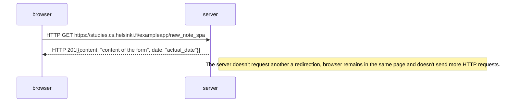

# one page application diagram

A SPA is a different style of web app creation. We find that the form element of the HTML code doesn't have action or method atributtes and a place to send the input data.

